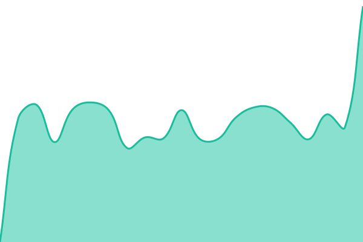
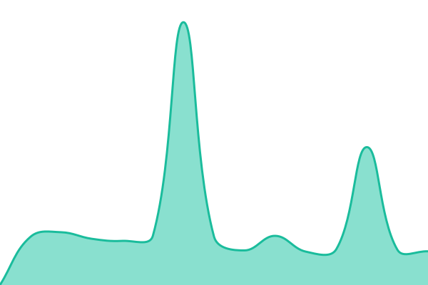
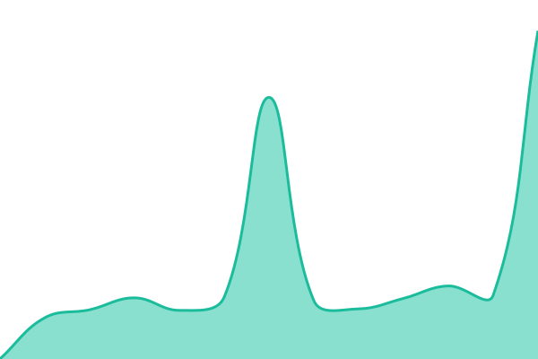
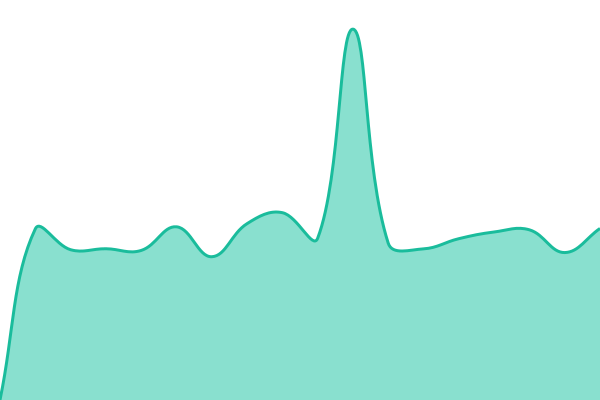
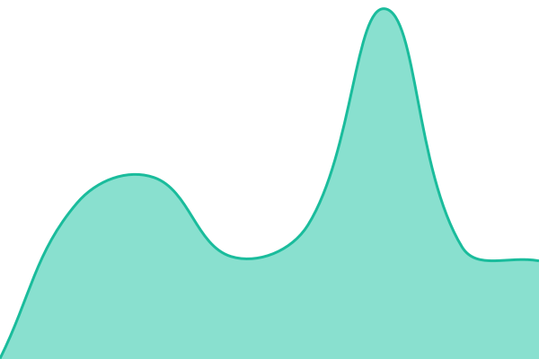
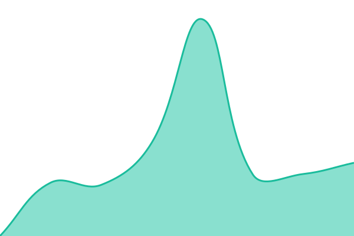
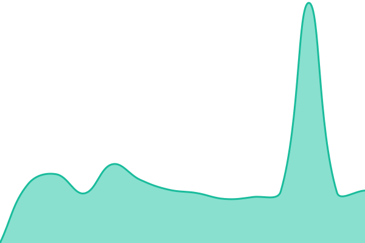
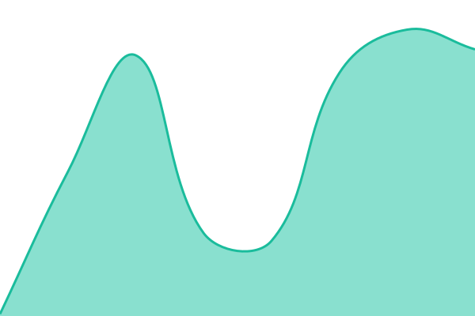

# [📈 Live Status](https://upptime.github.io/upptime): <!--live status--> **🟩 All systems operational**

This repository contains the open-source uptime monitor and status page for [Upptime](https://upptime.js.org), powered by [Upptime](https://github.com/upptime/upptime).

With [Upptime](https://upptime.js.org), you can get your own unlimited and free uptime monitor and status page, powered entirely by a GitHub repository. We use [Issues](https://github.com/upptime/upptime/issues) as incident reports, [Actions](https://github.com/linkhola-sn/uptime-monitor/actions) as uptime monitors, and [Pages](https://upptime.github.io/upptime) for the status page.

<!--start: status pages-->
<!-- This summary is generated by Upptime (https://github.com/upptime/upptime) -->
<!-- Do not edit this manually, your changes will be overwritten -->
<!-- prettier-ignore -->
| URL | Status | History | Response Time | Uptime |
| --- | ------ | ------- | ------------- | ------ |
|  [linkhola公式サイト](https://www.linkhola.com/) | 🟩 Up | [linkhola.yml](https://github.com/linkhola-sn/uptime-monitor/commits/HEAD/history/linkhola.yml) | 

 1308ms
     
 | 

<a href="https://linkhola-sn.github.io/uptime-monitor/history/linkhola">99.10%</a>
    

|  [CO2計算シミュレーション](https://linkhola-carbon.com) | 🟩 Up | [linkhola-carbon.com.yml](https://github.com/linkhola-sn/uptime-monitor/commits/HEAD/history/linkhola-carbon.com.yml) | 

 2542ms
     
 | 

<a href="https://linkhola-sn.github.io/uptime-monitor/history/linkhola-carbon.com">99.11%</a>
    

|  [EARTHSTORY LP](https://earthstory.jp/) | 🟩 Up | [earthstory.jp.yml](https://github.com/linkhola-sn/uptime-monitor/commits/HEAD/history/earthstory.jp.yml) | 

 1696ms
     
 | 

<a href="https://linkhola-sn.github.io/uptime-monitor/history/earthstory.jp">99.12%</a>
    

|  [EARTHSTORYクレジット申請](https://portal.earthstory.jp/login) | 🟩 Up | [portal.earthstory.jp.yml](https://github.com/linkhola-sn/uptime-monitor/commits/HEAD/history/portal.earthstory.jp.yml) | 

 609ms
     
 | 

<a href="https://linkhola-sn.github.io/uptime-monitor/history/portal.earthstory.jp">100.00%</a>
    

|  [EARTHSTORY MP](https://match.earthstory.jp/) | 🟩 Up | [match.earthstory.jp.yml](https://github.com/linkhola-sn/uptime-monitor/commits/HEAD/history/match.earthstory.jp.yml) | 

 3094ms
     
 | 

<a href="https://linkhola-sn.github.io/uptime-monitor/history/match.earthstory.jp">99.13%</a>
    

|  [こつこつLP](https://co2co2.jp/) | 🟩 Up | [co2co2.jp.yml](https://github.com/linkhola-sn/uptime-monitor/commits/HEAD/history/co2co2.jp.yml) | 

 668ms
     
 | 

<a href="https://linkhola-sn.github.io/uptime-monitor/history/co2co2.jp">100.00%</a>
    

|  [こつこつ管理画面](https://biz.earthstory.jp) | 🟩 Up | [biz.earthstory.jp.yml](https://github.com/linkhola-sn/uptime-monitor/commits/HEAD/history/biz.earthstory.jp.yml) | 

 346ms
     
 | 

<a href="https://linkhola-sn.github.io/uptime-monitor/history/biz.earthstory.jp">100.00%</a>
    

|  [こつこつ自治体](https://gift.earthstory.jp) | 🟩 Up | [gift.earthstory.jp.yml](https://github.com/linkhola-sn/uptime-monitor/commits/HEAD/history/gift.earthstory.jp.yml) | 

 3182ms
     
 | 

<a href="https://linkhola-sn.github.io/uptime-monitor/history/gift.earthstory.jp">100.00%</a>
    

|  [こつこつWeb](https://co2co2me.earthstory.jp/) | 🟩 Up | [co2co2me.earthstory.jp.yml](https://github.com/linkhola-sn/uptime-monitor/commits/HEAD/history/co2co2me.earthstory.jp.yml) | 

 728ms
     
 | 

<a href="https://linkhola-sn.github.io/uptime-monitor/history/co2co2me.earthstory.jp">100.00%</a>
    

|  [たたたん](https://tatatan.jp/) | 🟩 Up | [tatatan.jp.yml](https://github.com/linkhola-sn/uptime-monitor/commits/HEAD/history/tatatan.jp.yml) | 

 1208ms
     
 | 

<a href="https://linkhola-sn.github.io/uptime-monitor/history/tatatan.jp">99.14%</a>
    

|  [たたたん(base)](https://tatatan.base.ec/) | 🟩 Up | [tatatan.base.ec.yml](https://github.com/linkhola-sn/uptime-monitor/commits/HEAD/history/tatatan.base.ec.yml) | 

 1808ms
     
 | 

<a href="https://linkhola-sn.github.io/uptime-monitor/history/tatatan.base.ec">100.00%</a>
    

<!--end: status pages-->

[**Visit our status website →**](https://upptime.github.io/upptime)

## 📄 License

- Powered by: [Upptime](https://github.com/upptime/upptime)
- Code: [MIT](./LICENSE) © [Anand Chowdhary](https://anandchowdhary.com), supported by [Pabio](https://pabio.com)
- Data in the `./history` directory: [Open Database License](https://opendatacommons.org/licenses/odbl/1-0/)
